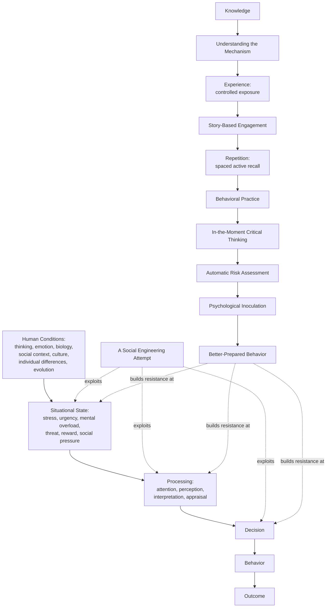

# The Knowing-Doing Gap in Social Engineering: A Multidisciplinary Look at Human Behavior, Human Error, and Behavioral Cybersecurity

**Part IV of this repository: a research-heavy companion to Parts I–III**

*Status: living document. This is an independent research paper. It proposes a way of looking at the problem and a possible direction for a solution it does not claim to have already proven a new theory. Where I'm giving you my own idea rather than an established finding, I say so directly.*

---

## Abstract

Most cybersecurity awareness programs are built on one quiet assumption: if a person knows the right behavior, they'll do it. This paper questions that assumption. A large body of research spanning health behavior, personal finance, safety science, and criminology shows that what people know and what people do are only loosely connected. I call this the **knowing-doing gap**: the well-documented pattern where a person who has the right, relevant knowledge still doesn't act on it under real conditions. My argument is that social engineering isn't mainly a problem of missing information. It's a problem of behavior under conditions urgency, authority, strong emotion, social pressure, mental overload that are specifically built to get between what someone knows and what they do. To make this case, I bring together research from cognitive psychology, behavioral psychology, biology and neuroscience, sociology, anthropology, behavioral economics, criminology, evolutionary science, individual-differences research, clinical psychology, and as the field that ties the others together in digital settings cyberpsychology. I then look at human-error research (Reason, 1990, 1997; Rasmussen, 1983) to show that even a person with correct knowledge can still take the wrong action, and I offer a proposed "anatomy of human error" as my own way of organizing this process, not as an already-proven model. Building on that, I propose a behavioral approach to cybersecurity training that combines storytelling, repetition and active recall, psychological inoculation (McGuire, 1961; Banas & Rains, 2010), and trained-in critical thinking. Finally, I connect this research to my existing practitioner framework, the Human Firewall Framework, showing how this paper gives some of its ideas a deeper research foundation without claiming that this research has already proven the framework works. I close by being honest about the limits of this paper and by laying out concrete experiments that could test it.

**Keywords:** knowing-doing gap, human error, social engineering, cybersecurity awareness, dual-process theory, psychological inoculation, behavioral cybersecurity, cyberpsychology, evolutionary mismatch, critical thinking, risk assessment, behavioral change

---

## 1. Introduction

Cybersecurity awareness programs almost always rest on an assumption so basic that it's rarely said out loud: knowledge leads to behavior. Teach someone what phishing looks like, and they won't click the link. Teach someone what a scam call sounds like, and they'll hang up. This idea feels obviously true, it's easy to build a program around, and as I'll argue in this paper it isn't well supported by the evidence.

I'm not saying knowledge doesn't matter. It clearly does. I'm saying knowledge is **necessary but not enough on its own**, and the gap between knowing and doing is a pattern researchers in organizational and health behavior have studied for decades so it isn't unique to cybersecurity. It shows up everywhere. People who know smoking causes cancer still smoke. People who know a payday loan is a bad idea still take one out. People who correctly spot a phishing email in a training exercise still click a real one under different conditions (a pattern I'll document directly in Section 8). If "people just don't know the rules" fully explained cybersecurity incidents, this same pattern wouldn't keep showing up across so many completely unrelated areas of life. Something else is going on and I don't think cybersecurity training has really grappled with what that something else is.

The central question this paper asks is simple to state:

> Why can people know what's right, understand what's wrong, and even correctly identify the risk and still do the wrong thing under certain conditions?

I look at this first as a general question about human behavior pulling in eleven different fields, in a deliberate order I explain in Section 3 before applying what I find specifically to social engineering. I want to be upfront about how I'm treating the evidence. Where I'm citing an established finding, I give you the source. Where I'm offering my own interpretation or extending existing research into a new area, I say so clearly. This paper's original contribution is mainly that combination not new experiments, which I haven't run, and which I lay out as a research agenda in Section 17.

---

## 2. Research Problem and Conceptual Gap

The knowing-doing gap isn't a new idea. Pfeffer and Sutton (2000) named it directly in management research, documenting how companies with excellent internal knowledge kept failing to act on it. The same basic pattern shows up under different names in different fields: the "intention-behavior gap" in health psychology (Sheeran, 2002), where a large review of studies found that a person's intention to act only weakly predicts whether they actually do; the finding in safety science that knowing about a hazard doesn't reliably predict safe behavior around it (Reason, 1997); and, closer to this paper's topic, the repeated finding in fraud research that scam victims are often well-educated, financially savvy adults who correctly understood the general risk before falling for one specific, well-executed version of it (Whitty, 2013; Modic & Lea, 2013).

Here's the gap I'm addressing: cybersecurity training and research have tended to treat social-engineering susceptibility as a **knowledge problem** something you fix by giving people more information. I think this framing misses something important, and I want to state the reason plainly: **knowledge and behavior come from different systems that only partly overlap.** Explaining a phishing click by saying "the employee didn't know better" treats knowledge as the only thing feeding into a decision, when decades of research on decisions, errors, and behavioral economics all show that a decision is the joint output of thinking, feeling, environment, social pressure, and the specific situation someone is in at that moment. So a paper trying to explain why social engineering works can't start with cybersecurity it has to start with a general picture of what actually drives human behavior, and only then ask what happens when that system gets deliberately targeted online.

---

## 3. What Is Human Behavior? A Foundation Built from Many Fields

I go through eleven fields, in a specific and deliberate order: cognitive psychology, behavioral psychology, biology and neuroscience, sociology, anthropology, economics and behavioral economics, criminology, an evolutionary perspective, individual differences, clinical psychology, and  placed last on purpose  cyberpsychology. 
Cyberpsychology comes last because I don't treat it as a rival field with its own separate psychology. I treat it as the place where all ten of the other fields get filtered through the specific conditions of a digital environment. Putting it first would make it look like "online behavior" is its own separate phenomenon. Putting it last makes the real point: it's the same human psychology, just operating under new conditions.

### 3.1 Cognitive Psychology

Cognitive psychology asks how people take in, process, and act on information and its most important finding for this paper is that this runs on **two distinguishable modes**. Kahneman (2011), building on decades of work by Kahneman, Tversky, Stanovich, and Evans, describes System 1 as fast, automatic, and driven by mental shortcuts, and System 2 as slow, effortful, and able to check System 1's output but only when it actually gets switched on. Kahneman and Frederick (2002) show that this checking process often fails to switch on under time pressure, heavy mental workload, or strong emotion exactly the conditions social engineers try to create (Section 7).

I want to flag a limit here rather than overstate this idea: the two-system picture is itself a simplified version of more continuous underlying processes, and some researchers (Keren & Schul, 2009) have criticized strict "two systems" models as too neat. I use this language because it's still the dominant, well-tested shorthand in decision research relevant to this paper not because I think there are literally two separate parts of the brain doing this.

Beyond the two-system idea, cognitive psychology documents specific mental shortcuts relevant here and one in particular matters a lot for social engineering: people tend to treat incoming information as true by default, and only start checking it if something specifically triggers suspicion (a pattern known as Truth-Default Theory; Levine, 2014). This matters directly: an attacker doesn't need to argue their way past careful scrutiny if they can avoid triggering that scrutiny in the first place.

### 3.2 Behavioral Psychology

Where cognitive psychology asks what a person knows and how they process it, behavioral psychology asks what actually shapes what a person does. Research on operant conditioning (starting with Skinner, 1938, and continued extensively since) shows that behavior is shaped more reliably by its consequences and by the surrounding environment than by facts someone has been told about it. This matters for cybersecurity in a specific way: a workplace can quietly reward exactly the behavior its own training argues against. If clicking through a security warning quickly gets rewarded with faster task completion and no visible downside, while pausing to verify gets no reward and sometimes gets a manager's impatience, the environment is training the opposite of what the training content teaches. Michie, van Stralen, and West's (2011) COM-B model captures this by breaking behavior down into Capability, Opportunity, and Motivation. Awareness training mostly targets one small piece conscious Capability and leaves Opportunity (the environment) and automatic, gut-level Motivation almost untouched.

### 3.3 Biology and Neuroscience

I want to be careful here, and say clearly what I'm not doing: I'm not going to present the popular "triune brain" idea that a "reptilian brain" sits underneath a "mammalian brain" and a "rational brain," stacked like layers as real neuroscience, because it isn't. That model, first proposed by MacLean (1990), has been largely rejected by researchers who study the anatomy of different animal brains (Cesario, Johnson, & Eisthen, 2020); they find no evidence that brains evolved by adding separate new layers on top of an unchanged, ancient core. What is well supported, and what I rely on instead, is a more modest claim: human thinking and emotion evolved over a long stretch of time, and the brain systems that handle threat detection, emotional arousal, and fast reactions weren't built for, and don't automatically adjust to, the specific demands of modern digital communication. This is the "evolutionary mismatch" idea I come back to in Section 3.8 (Li, van Vugt, & Colarelli, 2018).

Within that more careful framing, I do want to discuss the amygdala's documented role in threat and emotional memory. Work by Cahill and McGaugh (1995, 1996) and McGaugh (2004, 2018) shows that emotional arousal through stress hormones acting on the amygdala affects how strongly a memory gets locked in by the hippocampus, and this effect seems to depend on how intense the emotion is, not whether it's positive or negative. Separately, I want to address the popular phrase "amygdala hijack" (popularized by Goleman, 1995). It's a useful shorthand for something real intense emotion narrowing attention and weakening careful thinking but it isn't a literal description of the amygdala "taking over" the brain. The more accurate account, backed by research on stress and mental function (Arnsten, 2009), is that acute stress and strong emotion measurably weaken the parts of the brain responsible for working memory, planning, and self-control the exact functions that System 2 depends on. I use this more precise version throughout the paper instead of the "hijack" metaphor.

### 3.4 Sociology

People don't make decisions alone, weighing pure information in a vacuum they make them inside social structures. Classic research on conformity (Asch, 1956) and obedience to authority (Milgram, 1963) both studies that later drew methodological and ethical criticism, but both replicated in modified forms since shows that people will change what they say, or even what they do, under social and authority pressure, even when they privately think something different. Cialdini's (2007) well-known list of influence principles reciprocity, commitment/consistency, social proof, authority, liking, and scarcity describes, at a practical level, how this social pressure gets used persuasively. Independent studies of real phishing emails confirm these same principles show up at high, measurable rates in actual attacks (Bayl-Smith et al., 2021; Ferreira & Teles, 2019). What sociology contributes to this paper's argument is simple: a person's decision in the moment of a social-engineering attempt is shaped by what feels socially expected not wanting to seem rude, not wanting to question apparent authority just as much as by whatever they privately know the rule to be.

### 3.5 Anthropology

Anthropology adds something sociology alone doesn't fully capture: the specific content of trust, authority, and obligation is shaped by culture, and it's not safe to assume findings from one culture apply everywhere. Research comparing cultures (like Hofstede's work on national culture, and the studies that followed and sometimes challenged it) shows real differences in how societies weigh individual choice against group obligation, and in how much weight they give to hierarchy and authority differences that clearly matter for how a pretext built around authority or family duty will land in different places. Anthropology also gives me the idea I come back to in Section 10: for most of human history, knowledge, norms, and warnings about danger were passed down mainly through spoken stories, ritual, and hands-on learning not abstract, disconnected instructions (Boyd, Richerson, & Henrich, 2011, on how culture gets passed down). That's directly relevant to why story-based learning might fit human cognition better than checklist-based training.

### 3.6 Economics and Behavioral Economics

Classic economic models assumed decision-makers weigh up all the available information and pick the option that maximizes their benefit. Simon (1955) directly challenged this with the idea of **bounded rationality** the argument that real decision-makers work under limits on time, information, and mental capacity, so they "satisfice" (pick something good enough) rather than truly optimize. Kahneman and Tversky (1979) took this further with prospect theory, showing that people judge outcomes against a reference point and feel potential losses more strongly than equally sized gains (loss aversion) directly relevant to social-engineering pretexts built around avoiding a loss (a suspended account, a missed deadline…) rather than gaining something. The lesson behavioral economics offers this paper is that decisions made under uncertainty and limited mental bandwidth exactly the conditions of an ordinary busy workday reliably diverge from what pure knowledge of the "right" choice would predict.

### 3.7 Criminology

Criminology gives me routine activity theory (Cohen & Felson, 1979), which explains crime including, in later extensions of the theory, cybercrime and social engineering as the coming-together of a motivated offender, a suitable target, and the absence of a capable guardian. I find this framework valuable because it explains things at the level of the *situation*, not the *individual's character* it asks what made the target suitable and what protection was missing, without needing to say the target did anything wrong. I use this specifically to look at both sides of a social-engineering incident the attacker's manipulation strategy, and the situational conditions the target was in while holding onto a distinction I insist on again in Section 15: **explaining why manipulation worked is not the same as blaming the person it worked on.**

### 3.8 An Evolutionary Perspective

Evolutionary psychology proposes that many human tendencies threat detection, reciprocity, trusting people in your own group, sensitivity to status, loyalty to family reflect adaptations shaped by the social and physical environments our ancestors lived in (Tooby & Cosmides, 1992, among others; I'll note this remains an active research area with ongoing debate, not a closed, settled matter). The specific idea I lean on is **evolutionary mismatch**: the proposal, developed formally by Li, van Vugt, and Colarelli (2018), that mental habits shaped by ancestral conditions can produce bad outcomes when the amount, intensity, or meaning of the inputs they respond to changes in a new environment their own examples include modern food environments and, relevant here, social and information environments reshaped by technology.

I want to use this idea carefully, matching the caution the original researchers themselves show. I'm not claiming any specific behavior is a dedicated evolutionary adaptation "for" resisting or falling for digital deception that would be an untestable just-so story. My narrower, better-supported claim is that trust instincts, deference to authority, and reciprocity norms evolved and were tuned within small, face-to-face social groups, and that the scale, speed, anonymity, and engineered fakeness of digital communication give those instincts inputs they were never tuned to handle a mismatch, not a flaw.

### 3.9 Individual Differences

Not everyone responds the same way to the same manipulation attempt. Research on who's more likely to fall for a scam (Modic & Lea, 2013; Langenderfer & Shimp, 2001) finds that susceptibility tracks situational and temporary factors current stress level, time pressure, prior familiarity with a specific scam type, and self-reported impulsiveness rather than one fixed "gullible" personality trait, and, importantly, rather than lower general intelligence or education. I want to say clearly what this section is for: it's meant to show **variety among people**, not to identify a "vulnerable type" that could be singled out or looked down on. The honest reading of this research is that susceptibility is mostly about the situation and the moment, not a permanent trait certain people have and others don't.

### 3.10 Clinical Psychology

I bring in clinical psychology carefully, because this is the field most at risk of being misused to pathologize ordinary human error. The relevant, well-supported ideas are: a person's ability to regulate their emotions changes with their state and situation, not just their personality, and it gets worse under acute stress (Gross, 2002); psychological distress and mental overload both measurably worsen decision quality (a well-established finding in stress research, discussed above via Arnsten, 2009); and victims of fraud, including romance scams, often experience real psychological harm shame, self-blame, and in some documented cases responses similar to grief or trauma (Whitty & Buchanan, 2012; Cross, 2015, on how blame from others makes this worse). I want to be explicit that I'm not using clinical psychology here to suggest people who fall for social engineering have a diagnosable disorder. The goal is to understand what influences behavior and causes distress not to diagnose anyone.

### 3.11 Cyberpsychology: Where Everything Comes Together

Placed last, on purpose, cyberpsychology asks the question that organizes the rest of this paper: **what happens when the ordinary human psychology described in Sections 3.1 through 3.10 runs into a digital environment?** Suler's (2004) work on the online disinhibition effect is the clearest real-world example of this. He identifies specific, concrete features of online communication the sense of being anonymous, being invisible, not having to respond right away, and a weakened sense of authority that measurably change how normal social behavior and self-control (the same processes covered in Section 3.4 and Section 3.10) operate once someone is online. Suler's framework isn't a brand-new psychology invented for the internet. It's an account of how existing psychological processes get systematically altered by specific, identifiable features of a new environment. That's exactly how I want cyberpsychology to function in this paper overall not as an independent, thirteenth variable, but as the lens that shows how thinking, emotion, social pressure, culture, financial reasoning, opportunity, evolved instincts, individual differences, and emotional regulation all get filtered through anonymity, distance, fake signals of authority, and manufactured urgency the moment a person is interacting through a screen.

---

## 4. From Human Behavior to Human Error

Now that I've shown behavior comes from many systems working together, not knowledge alone, I want to make a second, related point using human-error research: **even a fully informed, well-meaning person can still take the wrong action.** This is the direct bridge to the knowing–doing gap.

James Reason's foundational work (1990, 1997)  built from studying major industrial disasters, including Chernobyl and the Piper Alpha oil-rig fire  proposed a way of sorting human error. He distinguished **slips** and **lapses** (a correctly planned action that goes wrong in the execution, usually during fast, automatic behavior) from **mistakes** (the plan itself was wrong, even though it was carried out exactly as intended), and separately from **violations** (a deliberate choice to break a rule). What matters most for this paper is that Reason explicitly framed slips, lapses, and mistakes as coming "from the normal cognitive processes of humans rather than moral failures in intent" (as later summaries of his work describe it; see IOSH, 2025)  which is exactly the same distinction between error and deliberate misconduct that I insist on again in Section 15.

Reason's way of sorting errors builds on Rasmussen's (1983) skill-rule-knowledge (SRK) model, which describes three levels of mental control: **skill-based** performance (automatic routines that take almost no conscious effort), **rule-based** performance (recognizing a familiar situation and applying a learned if-then rule), and **knowledge-based** performance (working through something new, which takes real, effortful problem-solving). Each level has its own typical failure pattern: skill-based performance is prone to simple attention slips; rule-based performance is prone to misreading a situation and applying the wrong (but perfectly well-learned) rule, or applying a good rule to the wrong situation; and knowledge-based performance is prone to gaps in information, and gets much worse under workload and time pressure.

This directly explains something puzzling at the heart of the knowing-doing gap: **most of what we do every day, including security-related behavior, runs at the skill or rule level, not the knowledge level where formal training content actually lives.** An employee doesn't consciously reason through "should I click this link?" from scratch every time they recognize a pattern (an email that looks like normal correspondence) and apply a learned rule (respond as usual). A well-made phishing email isn't defeating the employee's knowledge that phishing exists. It's exploiting the fact that their moment-to-moment behavior runs on pattern recognition, and a convincing enough fake satisfies that pattern.

### 4.1 A Proposed Anatomy of Human Error

I want to pull this into a working chain and I'm labeling it clearly as my own proposal, not an established, universal sequence. Each stage draws on established research (situation awareness: Endsley, 1995; how people evaluate a situation emotionally: Lazarus, 1991; and the decision and action stages found across general models of how humans process information), but I'm not aware of any single validated model that names these exact eight stages, in this order, specifically for analyzing security-related human error:

**Situation → Perception → Attention → Interpretation → Appraisal → Decision → Action → Outcome**

I propose that a social-engineering error can happen at any point in this chain. A forged sender address exploits *Perception*. A manufactured sense of urgency exploits *Attention* by narrowing what a person even notices. A plausible claim of authority exploits *Interpretation*. Manufactured emotional stakes exploit *Appraisal*. And time pressure weakens the *Decision* stage no matter how correct the person's underlying knowledge was. I offer this chain as a tool for thinking and design a way to ask, for any given piece of training, "which stage does this actually address?" not as a claim that the human mind literally moves through eight separate, one-after-another steps every time.

---

## 5. The Knowing-Doing Gap

With the groundwork and the error framework in place, I can now state the knowing-doing gap more precisely than in the introduction. Sheeran's (2002) review of health-psychology studies found that a person's intention to act explains only a moderate share of whether they actually go on to act a formal, numbers-based demonstration that even *intending* to use your knowledge is a weak predictor of actually doing it, let alone the knowledge alone. Pfeffer and Sutton's (2000) research on organizations found the same pattern at a company-wide scale: firms whose staff correctly understood best practice still repeatedly failed to put it into action, for reasons including a fear of failing, a habit of talking about action as a stand-in for actually doing it, and incentive structures that pointed the wrong way an organization-sized version of the same COM-B pattern discussed in Section 3.2.

You can find the same pattern across many other areas: patients who understand their medication instructions in detail still show high rates of not following them, in study after study of chronic illness; smokers who correctly state the health risks keep smoking at rates that a pure knowledge gap can't explain; and, closest to this paper's focus, fraud victims are repeatedly found to be no less educated or well-informed than non-victims and in some studies, they specifically report already knowing about the general type of scam before being fooled by one particular, well-executed version of it (Whitty, 2013). The lesson that keeps showing up across all these areas is that **having correct knowledge is a weak predictor of behavior once you add in situation, emotion, and social pressure** exactly the things a social engineer deliberately manipulates.

---

## 6. The Brain, Emotion, and Decisions Made Under Pressure

Coming back to the neuroscience from Section 3.3, I want to connect it more directly to social engineering. The well-established finding that acute stress and strong emotion weaken the parts of the brain responsible for planning, working memory, and self-control (Arnsten, 2009) describes, in more precise terms, exactly the abilities Kahneman's (2011) System 2 relies on to check System 1's fast, automatic output. A social engineer doesn't need any special knowledge of neuroscience to take advantage of this. They just need to reliably create urgency, fear, excitement, or social pressure — because these states are already well documented, through ordinary and well-replicated stress research, to measurably weaken the exact mental abilities a person would otherwise use to catch the deception.

I noted in Section 3.3 that I'm treating "amygdala hijack" as a helpful metaphor, not a literal mechanism. I want to restate the more careful version here, because it's central to this paper's whole argument: **social engineers don't need to "hack" any one specific brain structure. They just need to create the general conditions arousal, a sense of threat, time pressure, the promise of a reward that are well documented to push people toward faster, less careful thinking, whatever the exact underlying brain mechanism turns out to be.** This is a more modest claim than the popular "hijacking" story, but it's also a more defensible one, and it leads to the same practical conclusion: training that only tests people in a calm, unhurried, low-stakes setting (a module completed at a desk with no time pressure) hasn't been tested under, and so can't be assumed to hold up under, the actual physical and mental conditions the real decision will be made in.

---

## 7. Social Engineering as an Attack on Behavior

I now turn directly to social engineering, which I define following the way it's used in both academic and practitioner cybersecurity writing (Mitnick & Simon, 2002; Hadnagy, 2018) as the use of psychological influence and deception to get someone to take an action, or hand over information, that serves an attacker's goal rather than the target's own interests. Here's the key reframing I want to establish: **social engineering isn't mainly an attack on what a person knows. It's an attack on what a person does, carried out by deliberately engineering the situation and emotions under which that action happens.**

Pulling together Sections 3.4 (sociology) and 3.6 (behavioral economics), the specific levers social engineers pull are well documented and confirmed again and again in studies of real attacks: authority, urgency (a close cousin of manufactured scarcity), fear, curiosity, the promise of a reward, a sense of social obligation, familiarity, and emotional closeness (Cialdini, 2007; Ferreira & Teles, 2019; Stajano & Wilson, 2011). None of these levers need the target to be unaware that social engineering exists as a general idea. Ferreira and Teles's (2019) study of real phishing emails found Authority, Strong Affect, Integrity, and Reciprocation to be the most common levers used a finding that only makes sense if these techniques work on people who, in the abstract, already know phishing is a thing.

---

## 8. The Social Engineering-Awareness Paradox

This sets up what I call the central paradox of this paper. A person might correctly state the rule ("don't click suspicious links"), correctly believe the general risk ("phishing is dangerous"), have completed formal training, and even correctly spot phishing examples shown to them calmly, with no time pressure, outside of any real workflow, during that training. Verizon's (2021) Data Breach Investigations Report offers a striking, real illustration of exactly this: among more than 1,100 employees who each received both a real phishing email and a simulated one, not one clicked the simulated phish but 2.5% clicked the real one. The knowledge being tested was, presumably, identical in both cases. What was different was the situation and the emotional context exactly the variables that Sections 3 through 7 identify as actually governing behavior, and which a calm training module or an announced test simply doesn't reproduce.

The explanation this paper explicitly rejects is "because people are careless." That explanation treats the click as a lack of effort or attention. The evidence above suggests something different: the click is the predictable result of well-understood mental and physical processes doing exactly what they evolved and developed to do, under conditions deliberately built to trigger them.

---

## 9. Why Knowing the Rules Doesn't Guarantee Safe Behavior

I want to say directly why knowledge alone has such limited reach in this specific area. Three lines of evidence point the same way:

First, **the path from knowledge to action runs through the wrong mental level.** As Section 4 established, everyday behavior mostly runs on skill- and rule-based processing (Rasmussen, 1983), while formal training content is delivered as, and stored as, knowledge-level, explicit information. A person can hold correct explicit knowledge ("I know phishing exists and looks like X") without that knowledge ever being wired into the fast, rule-based pattern recognition that actually governs their split-second reaction to an incoming message.

Second, **knowledge learned in a calm state doesn't automatically transfer to a stressed state.** This follows directly from research showing that skills and associations formed under one set of physical and mental conditions don't automatically carry over to a different set of conditions  especially when the difference involves being under acute stress or not (consistent with Arnsten's, 2009, findings on stress and mental function).

Third, **training content is often delivered in a form that's naturally hard to remember.** Recall Section 3.3's point about emotional memory (Cahill & McGaugh, 1995, 1996; McGaugh, 2004): flat, low-energy content, delivered once a year, is exactly the kind of content memory research would predict to be poorly retained and this is true independent of anything specific to social engineering at all.

I want to be careful here, in keeping with this paper's commitment to honesty about the evidence, not to overstate this into a claim that training accomplishes nothing. Caputo, Pfleeger, Freeman, and Johnson (2014) and other researchers who've studied embedded, in-context, repeated training have found more encouraging results than single, once-a-year sessions a point I come back to in Section 11. My claim is narrower, and I think better supported: **knowledge alone, delivered once, outside of a realistic setting, without any behavioral practice, isn't enough to reliably shape behavior under the specific, pressured conditions social engineering creates.**

---

## 10. Storytelling, Learning, and Behavioral Change

I now want to make a constructive proposal rather than just another critique: what kind of learning actually fits the mental realities laid out above? I think story-based learning deserves serious consideration, and I want to ground that in real research on narrative persuasion, not just intuition.

Green and Brock's (2000) research on narrative persuasion shows, across controlled experiments, that people who become mentally and emotionally "transported" into a story a real, measurable state argue back less against the story's ideas, adopt beliefs more in line with the story, and remember the content better, compared to the same information delivered in a non-story format. Research on how culture gets passed down (Boyd, Richerson, & Henrich, 2011) puts this into a much longer historical context: for most of human history, humans have passed on warnings about danger, social norms, and models of behavior through spoken stories, myths, and hands-on apprenticeship, with abstract, disconnected, written instruction being a fairly recent and, on this account, less naturally fitting way to teach.

I want to state my claim carefully, matching this paper's evidence standards: I'm not claiming storytelling is the one and only thing that can change behavior in cybersecurity, and I'm not claiming it's already been directly tested at scale in this specific field that would overstate what we know. What I am claiming is that being drawn into a story is a well-documented way to improve attention, emotional engagement, identifying with someone's situation, and memory (all four separately backed by research: Green & Brock, 2000; and Section 3.3 more generally on emotional memory), and that these are exactly the things Section 9 identifies as missing from typical, low-engagement training content. Using real, story-driven case studies instead of abstract policy statements as the main way to teach social-engineering awareness is my own proposed idea, built on solid narrative-persuasion research not itself a tested cybersecurity intervention.

---

## 11. Interactive Learning and Repetition

### 11.1 Interactive and Game-Based Learning

Video games and other interactive settings work differently from just handing someone content to read: they require the learner to act, see a consequence, and adjust a pattern related to learning through experience and feedback more generally. I want to be careful with the evidence here. A review of many studies on game-based learning by Wouters, van Nimwegen, van Oostendorp, and van der Spek (2013) found that serious games produced somewhat better learning outcomes than regular teaching methods, on average but the effect wasn't automatic or uniform. It depended on the quality of the game's design, on whether the game came with additional instructional support, and on people playing across multiple sessions rather than just once. I'm not going to claim, because the evidence doesn't support it, that "video games change behavior" as a flat, unqualified statement. The narrower and more defensible claim is that well-designed interactive experiences can, under the right conditions, improve learning and engagement more than passive instruction and that many games are themselves story-driven, meaning a well-designed interactive social-engineering exercise can combine the storytelling benefits from Section 10 with direct behavioral practice (Section 11.2), rather than treating those as two separate ideas.

### 11.2 Repetition, Active Recall, and Retention

A single time reading or hearing correct information shouldn't be assumed to build lasting behavioral skill and this isn't a claim specific to cybersecurity at all. It follows directly from more than a hundred years of memory research, starting with Ebbinghaus's (1885) work on the "forgetting curve." Two well-replicated findings matter here. First, the **testing effect**: Roediger and Karpicke (2006) showed that actively trying to recall information from memory (being tested on it) produces much better long-term retention than spending the same amount of time re-reading the same material a finding since confirmed many times over in classrooms and real-world settings. Second, the **spacing effect**: a large review of 254 studies by Cepeda, Pashler, Vul, Wixted, and Rohrer (2006) confirmed that spreading repeated exposure to material out over time produces noticeably better long-term retention than cramming the same total amount of exposure into one sitting directly relevant to the common practice of a single annual training session.

I want to state the takeaway carefully rather than overreach: this research supports **spaced, active-recall practice** over single-session, read-and-recognize training. It doesn't, by itself, tell us the ideal frequency or spacing specifically for security training that's a question, as I note in Section 17, that needs dedicated experiments in this exact area. What is well supported is the general principle that **what gets repeated (actively recalling it versus just re-reading it), and how far apart the repetitions are, matter more than simply how often training happens.**

---

## 12. Psychological Inoculation Against Social Engineering

I now come to what I think is this paper's most direct, practical idea for closing the knowing-doing gap in this field: applying **psychological inoculation theory** to social engineering.

McGuire's (1961) and McGuire and Papageorgis's (1961) original research at Yale drew a direct comparison to medical vaccination: exposing someone to a weakened, already-refuted version of a persuasive argument builds resistance to a stronger version of that same argument later on as long as the exposure includes both a *threat* component (a warning that your current position is vulnerable, which motivates you to pay attention) and a *refutational* component (actually practicing a counterargument against the weakened version). Banas and Rains's (2010) large review of this research confirmed that inoculation reliably works across many different situations, and found something important: an "umbrella" effect, where the resistance built by inoculation carries over to brand-new counterarguments and manipulation attempts that were never specifically covered in training as long as the inoculation targeted the underlying *technique*, not just one specific claim. More recent work on "prebunking" (van der Linden, Leiserowitz, Rosenthal, & Maibach, 2017, applied to misinformation) shows that briefly exposing people to a named manipulation technique measurably lowers how easily they're fooled by that technique later, even in situations they've never seen before.

My proposed way of applying this to social engineering and I want to be clear this is my own idea, not an already-proven, cybersecurity-tested intervention is what I'll call **fighting the problem with the problem**: instead of only telling learners that social engineers manipulate people, safely and ethically expose them to controlled, clearly bounded examples of the actual techniques urgency, authority, curiosity, reciprocity, fear let them notice their own in-the-moment reaction, then clearly reveal the technique and name it, then give them a chance to reflect, then repeat with a different scenario. I want to state the goal in realistic terms rather than overclaiming: the point isn't literal psychological "immunity" a word I avoid except as an acknowledged figure of speech but rather **better recognition, more resistance, more self-awareness about one's own reactions, and being better prepared to act.** That's the language Banas and Rains's (2010) own research supports, and it lines up directly with the "umbrella" finding that general resistance to a technique, not memorizing one specific example, is where the real value is.

---

## 13. Critical Thinking and Risk Assessment as Practiced Skills

I want to develop one more idea here again, my own proposed direction, needing testing rather than already proven that a big part of the knowing-doing gap in this area is the failure to turn general knowledge into **automatic, in-the-moment critical thinking and risk assessment**, as opposed to critical thinking as just an abstract skill. My goal isn't to make people suspicious of everything, which would be exhausting and would damage normal working relationships. It's to make a small set of situational questions become second nature through practice: *Who's asking? Why are they asking, and why now? What exactly do they want me to do? What happens if I go along with it, and what happens if I pause to check first? Can I verify this independently, through a channel I control rather than one the requester gave me? Is something creating pressure that specifically discourages me from checking?*

I want to frame this clearly as a proposed protective idea that needs real practice to work, not a claim that teaching critical thinking in the abstract automatically makes someone resistant to manipulation the evidence throughout this paper (especially Sections 4 and 9) suggests the opposite: knowing a rule and automatically applying it under pressure are two different skills, connected only through the kind of repeated, situational practice discussed in Sections 11 and 12. The questions in this section are really a target for the recall-practice and inoculation ideas already laid out, rather than a fifth, separate intervention.

---

## 14. A Proposed Model, Pulled Together

Here I bring together Sections 3 through 13 into one integrated picture. I'm labeling this clearly, in line with this paper's approach to evidence, as **my own proposed synthesis** not an already-proven model of cause and effect. Every individual piece draws on cited research; combining them into one single path is my own contribution, and it needs the kind of direct testing I lay out in Section 17.

**Human Conditions** (thinking, emotion, biology, learning history, social context, culture, individual differences, evolutionary background, physical and workplace environment)

↓

**Situational State** (stress, urgency, mental overload, sense of threat, expected reward, social pressure, uncertainty)

↓

**Processing the Information** (attention, perception, interpretation, appraisal, risk assessment)

↓

**Decision**

↓

**Behavior**

↓

**Outcome**

Social engineering, on this picture, can step in at more than one point in this chain at once a phishing pretext can raise stress (urgency), narrow attention (one single, eye-catching call to action), and skew judgment (framing something as a loss) all at the same time which is part of why a defense that only fixes one point in the chain (a warning banner that only helps with perception) probably isn't enough on its own.

Against this chain of vulnerability, I propose a matching, protective path:

**Knowledge → Understanding the Mechanism → Experience (safe, controlled exposure) → Story-Based Engagement → Repetition (spaced, active recall) → Behavioral Practice → In-the-Moment Critical Thinking → Automatic Risk Assessment → Psychological Inoculation**

↓

**Better-Prepared Behavior**

Here's the same structure as a diagram, in Mermaid format:

---

## 15. What This Means for Cybersecurity Awareness

If this way of putting things together holds up, a few practical design ideas follow and I want to state these as things the research points toward, not as already-proven rules. Training should treat **realistic emotional and situational conditions** as a basic requirement, not a nice extra, since Sections 6 through 9 show that behavior in a calm, low-stakes setting is a poor stand-in for behavior under the pressure real attacks create. Programs should build in **spaced repetition with active recall** instead of one concentrated annual session (Section 11.2). Programs should **name and teach the underlying persuasion technique**, not just the surface-level warning sign, since the whole argument of Sections 6 through 12 is that recognizing the technique not memorizing the rule is what carries over to new, never-seen attacks (the "umbrella" effect; Banas & Rains, 2010). And programs should build in **safe, ethical, controlled exposure to weakened manipulation attempts** as its own distinct piece, separate from just handing out information because inoculation theory specifically requires actual practiced resistance, not just being warned.

---

## 16. How This Connects to the Human Firewall Framework

Having built this multidisciplinary case, I want to say precisely how it connects to my existing practitioner framework, the **Human Firewall Framework (HFF)**. This paper isn't a restatement of the HFF, and I don't want to claim that the research reviewed here proves the HFF works no outcome data on the HFF itself has been presented in either document. What this paper does offer is a deeper, more clearly multidisciplinary research foundation for several of the HFF's four functions, which were originally built from a narrower, more cybersecurity- and communication-focused set of sources.

The HFF's Function 1 (removing the blame) is directly backed by this paper's insistence, made across Sections 4, 7, and 9, that human error comes from normal mental processing under tough conditions, not from moral or intellectual failure and by Section 3.7's point from criminology that explaining a cause isn't the same as assigning blame. The HFF's Function 2 (teaching the mechanism, not the checklist) is directly backed by Section 12's discussion of the "umbrella" effect in inoculation research, which specifically favors learning the underlying technique over memorizing one example. The HFF's Function 3 (building resistance through controlled exposure) is, in effect, Section 12 of this paper put into practice this paper develops the underlying inoculation mechanism in more depth, and with more care about its scientific limits, than the HFF's original document did. The HFF's Function 4 (designing for retention) is backed by this paper's Sections 3.3, 10, and 11 on emotional memory, storytelling, and active-recall practice.

I want to be just as clear about what this connection does *not* prove: this paper looks at the underlying **behavioral, multidisciplinary problem** why the knowing-doing gap exists and what general ideas might narrow it. The HFF is a **practitioner design** a specific, applied structure built from this reasoning and other sources. Neither document should be read as proof that the other's specific recommendations produce measured results. That empirical work still needs to be done, which is exactly what Section 17 lays out.

---

## 17. Limits of This Paper and a Research Agenda

I want to be upfront about this paper's limits rather than let them come up only if someone challenges it. First, **the proposed model in Section 14 hasn't been tested as a complete, connected whole.** Each piece is backed by real research, but the exact order and how the pieces interact (does story-based engagement need to come before or after understanding the mechanism? does inoculation exposure interact with how repetition is spaced out?) are hypotheses, not findings. Second, **individual differences and culture** (Sections 3.5 and 3.9) mean any specific approach's effectiveness likely varies across different groups of people in ways this paper hasn't measured. Third, **inoculation theory's limits aren't fully mapped for this specific area** Banas and Rains's (2010) review covers a wide range of situations, but research on inoculation specifically for social engineering is still fairly thin, and I haven't found strong direct evidence pinning down the ideal intensity, frequency, or variety of scenarios for this exact use. Fourth, **awareness training in general is genuinely hard to measure**: self-reported intention is a weak stand-in for real-world behavior (Section 5), phishing-simulation click rates might not carry over to other kinds of attacks, and **realism** whether a controlled or simulated exposure actually produces the same mental state as a genuine, high-stakes attack is a persistent, and I think under-discussed, problem across this whole area of research, including in some of the training-effectiveness studies this paper's companion document (Part I) relies on. Finally, this paper is, by design, a way of connecting existing research rather than a report of new data I've collected myself; its main contribution is putting pieces together, and that kind of contribution needs a correspondingly higher amount of follow-up testing before it should be treated as settled.

I propose the following concrete set of experiments to address these limits:

1. **Controlled social-engineering scenario studies** comparing how well people detect and resist attacks after conventional knowledge-based training versus story-plus-inoculation training, keeping total training time the same in both groups.
2. **Inoculation-specific experiments** that vary how "weakened" the practice manipulation attempt is, and measure resistance to a completely new, untrained manipulation technique testing the "umbrella" prediction directly in this area.
3. **Before-and-after testing with delayed follow-ups**, measuring retention at multiple points in time (in line with spacing-effect research design; Cepeda et al., 2006), not just right after training ends.
4. **Comparing knowledge-only training to experience-and-practice training**, using real or realistic simulated decision moments as the outcome measure, instead of multiple-choice recognition tests.
5. **Measuring risk-assessment behavior under deliberately increased mental load and time pressure**, to directly test whether the critical-thinking habits proposed in Section 13 hold up under the weakened mental function described in Section 6.
6. **Measuring recognition and resistance specifically while people are under real emotional arousal**, using ethically approved methods, to test directly whether prior inoculation training measurably reduces the System 2 breakdown predicted in Section 6.
7. **Testing whether resistance carries across channels and time** for example, does training against simulated phishing emails carry over to a completely different attack channel, like a live scam phone call? This would give direct evidence for or against the idea that learning the underlying technique (rather than memorizing a checklist) is what actually generalizes.

I haven't run any of these experiments myself, and I want to be clear that this paper's claims about how *effective* the proposed model would be remain hypotheses waiting on exactly this kind of testing. The claims about the *individual pieces of research* (dual-process theory, inoculation theory, active recall, and so on) are, by contrast, already well supported by the existing studies cited throughout this paper.

---

## 18. Conclusion

I opened this paper with a question: why can a person know what's right, and still do what's wrong? The multidisciplinary picture built here suggests this is the wrong kind of question to answer with a single-field explanation, because behavior itself isn't produced by a single system. Thinking, emotional and physical state, social context, cultural framing, financial reasoning under uncertainty, situational opportunity, evolutionary background, individual history, and filtering all of these into the digital settings where social engineering actually happens cyberpsychology, all combine to shape what a person does in a given moment, in ways that stored knowledge only partly controls.

Human-error research shows that even well-functioning minds, working exactly as they're supposed to, produce errors under identifiable conditions and social engineering, on the account built here, is best understood as the deliberate manufacturing of exactly those conditions. If that's right, the practical takeaway isn't that cybersecurity training should stop teaching facts. It's that training should stop treating facts as enough on their own. Story-based engagement, spaced and active repetition, psychological inoculation through safe and ethical exposure, and deliberately building automatic not just abstract critical thinking and risk assessment together offer a fuller, more evidence-backed picture of what might close the gap between knowing and doing than information alone ever could. Whether this specific combination actually works in practice is now a question for the research agenda in Section 17 not something this paper is in a position to claim it has already proven.

---

## Evidence Table

| Claim / Concept | Discipline | Key Evidence | Source | Evidence Type | Relevance |
|---|---|---|---|---|---|
| Two modes of thinking (System 1/System 2); careful thinking gets disabled under time pressure or heavy workload | Cognitive psychology | Extensive decision-making research | Kahneman (2011); Kahneman & Frederick (2002) | Established evidence | Explains why urgency and workload stop people from noticing something is wrong |
| Truth-default: people treat incoming messages as true unless something specifically triggers doubt | Cognitive psychology | Deception-detection research | Levine (2014) | Established evidence | Explains why phishing doesn't need to "argue" its way past careful checking |
| Behavior is shaped more by its environment and consequences than by what people are told | Behavioral psychology | Research on conditioning | Skinner (1938); Michie, van Stralen, & West (2011) | Established evidence | Explains why training-based knowledge may not carry over into workplace behavior |
| Acute stress and strong emotion weaken planning, focus, and self-control | Neuroscience | Stress-and-cognition research | Arnsten (2009) | Established evidence | Explains, mechanically, why urgency and fear weaken careful thinking |
| Emotional arousal strengthens memory, regardless of whether the emotion is positive or negative | Neuroscience | Human studies of memory and brain activity | Cahill & McGaugh (1995, 1996); McGaugh (2004, 2018) | Established evidence | Supports using emotionally engaging (not necessarily fear-based) content to improve retention |
| The "triune brain" (separate reptile/mammal/rational layers) is not an accurate picture of how brains evolved | Neuroscience | Comparative study of animal brain structures | Cesario, Johnson, & Eisthen (2020) | Established evidence (a correction of a myth) | Rules out an outdated idea this paper deliberately avoids |
| "Amygdala hijack" is a helpful metaphor, not a literal mechanism | Neuroscience / popular science | Where the term came from, and later critique | Goleman (1995); Arnsten (2009) for the more accurate underlying process | My own careful interpretation | Requires using the term precisely, not literally |
| Persuasion techniques (authority, scarcity, social proof, reciprocity, liking, commitment) show up often in real phishing emails | Sociology / persuasion research | Studies analyzing real attack samples | Cialdini (2007); Ferreira & Teles (2019); Bayl-Smith et al. (2021) | Established evidence | Confirms attackers use well-documented, general social techniques |
| Culture shapes how authority, obligation, and trust work | Anthropology | Cross-cultural comparative research | Hofstede's work on national culture; Boyd, Richerson, & Henrich (2011) | Established evidence | Warns against assuming a pretext works the same way everywhere |
| Bounded rationality: people make "good enough" decisions under limited time, information, and mental capacity | Behavioral economics | Foundational decision-theory research | Simon (1955) | Established evidence | Explains why people don't act like perfectly rational decision-makers |
| Loss aversion: losses feel worse than equal-sized gains feel good | Behavioral economics | Prospect theory experiments | Kahneman & Tversky (1979) | Established evidence | Explains why "your account will be suspended" pretexts work so well |
| Routine activity theory: crime needs a motivated offender, a suitable target, and no capable guardian | Criminology | Foundational criminology theory, widely applied to cybercrime | Cohen & Felson (1979) | Established evidence | Frames social engineering as a situation, without blaming the target |
| Evolutionary mismatch: instincts shaped by ancestral life can misfire in brand-new modern environments | Evolutionary psychology | Theoretical synthesis backed by supporting evidence | Li, van Vugt, & Colarelli (2018) | Established evidence (a theoretical synthesis) | Explains digital-era susceptibility without any "ancient brain" claims |
| Scam susceptibility tracks situation and mental state (stress, impulsiveness, familiarity), not low intelligence or a "gullible personality" | Individual differences | Interviews and surveys with fraud victims | Modic & Lea (2013); Langenderfer & Shimp (2001) | Established evidence | Shows real variety between people; rules out a stigmatizing "vulnerable type" story |
| Human error: slips, lapses, and mistakes come from normal thinking, not moral failure | Safety science / human-error research | Analysis of major industrial accidents; a foundational book | Reason (1990, 1997) | Established evidence | Core support for treating error as separate from moral failure |
| Skill-rule-knowledge (SRK) levels of mental control, each with its own type of typical error | Human factors / cognitive engineering | A foundational model in this field | Rasmussen (1983) | Established evidence | Explains why most behavior runs below the "knowledge" level that training targets |
| Intentions only weakly predict what people actually go on to do | Health psychology | A large review of many studies | Sheeran (2002) | Established evidence | Direct evidence for the general knowing–doing gap |
| Organizations that correctly understand best practice still repeatedly fail to act on it | Management / organizational behavior | Case-based organizational research | Pfeffer & Sutton (2000) | Established evidence | Cross-domain evidence this gap isn't specific to cybersecurity |
| Being drawn into a story reduces arguing-back, and improves recall and belief change | Communication / social psychology | Controlled experiments | Green & Brock (2000) | Established evidence | Supports the case for story-based awareness content |
| Testing effect: actively recalling information beats re-reading it for long-term memory | Cognitive psychology (memory) | Controlled experiments, widely replicated | Roediger & Karpicke (2006) | Established evidence | Supports active-recall repetition over passive re-reading |
| Spacing effect: spreading out practice beats cramming it, for long-term memory | Cognitive psychology (memory) | A review of 254 studies | Cepeda, Pashler, Vul, Wixted, & Rohrer (2006) | Established evidence | Argues against a single once-a-year training session |
| Serious games produce modest learning gains, depending on design quality and repeated use | Educational psychology | A review of many studies | Wouters, van Nimwegen, van Oostendorp, & van der Spek (2013) | Established evidence (with conditions) | Supports careful, conditional use of interactive/game-based training |
| Inoculation theory: warning plus practiced rebuttal builds resistance to stronger persuasion attempts later | Communication / social psychology | Founding experiments; a large review of the research | McGuire (1961); McGuire & Papageorgis (1961); Banas & Rains (2010) | Established evidence | Core mechanism behind this paper's proposed "fight the problem with the problem" approach |
| "Umbrella" effect: resistance to one specific technique carries over to new, untrained versions of that technique | Communication / social psychology | A large review, plus applied "prebunking" research | Banas & Rains (2010); van der Linden et al. (2017) | Established evidence | Supports teaching the technique itself over teaching a checklist |
| Online disinhibition: anonymity, invisibility, and delayed response change how people normally behave and self-regulate online | Cyberpsychology | A theoretical model, tested and applied extensively since | Suler (2004) | Established evidence | A model example of how digital features change existing psychology |
| Romance-scam victims show the same kind of decision-making mistakes as victims of other mass-marketing fraud, not general gullibility | Criminology / cyberpsychology | An interview study with financial and non-financial victims | Whitty (2013) | Established evidence | Shows the knowing–doing gap outside a workplace setting |
| Simulated phishing got a 0% click rate; a real phishing email sent to the same group got 2.5% | Applied cybersecurity research | A large real-world dataset | Verizon (2021) Data Breach Investigations Report | Established evidence (a single dataset) | A direct, real-world illustration of the awareness paradox |
| A proposed "anatomy of human error" chain (Situation → Perception → Attention → Interpretation → Appraisal → Decision → Action → Outcome) | My own synthesis, built from human factors and cognitive psychology research | Built from Endsley (1995), Lazarus (1991), and Rasmussen (1983) | This paper (my own proposal) | My proposed hypothesis | A tool for diagnosis and design — not an already-proven universal model |
| A proposed protective path (knowledge → mechanism → experience → story → repetition → practice → critical thinking → risk assessment → inoculation → preparedness) | My own synthesis, across all fields covered | Built from the individually cited research above | This paper (my own proposal) | My proposed hypothesis | This paper's central original idea; needs the testing laid out in Section 17 |

---

## Research-Gap Table

| What's Commonly Assumed | The Limit or Gap | What This Paper Adds |
|---|---|---|
| Cybersecurity incidents are usually explained as a lack of awareness or knowledge | This framing doesn't explain why well-informed, trained people still fall for attacks, and it ignores the general, cross-field knowing–doing gap | Reframes susceptibility as coming from thinking, emotion, situation, and social pressure together, not a knowledge gap alone, using evidence from health, organizations, and crime research |
| Human error in cybersecurity is often treated as carelessness or a training failure | Established human-error research (Reason, Rasmussen) shows errors come from normal mental processing at the skill/rule level, not from not trying or not knowing | Uses the SRK model and the slips/lapses/mistakes framework specifically to explain why factual security knowledge doesn't reach the level of behavior that governs real-time reactions |
| Loose talk about the amygdala "hijacking" the brain shows up often in popular cybersecurity writing | Loose usage risks overstating a metaphor as literal fact, and risks reviving the debunked "triune brain" idea | Offers a scientifically accurate substitute (stress weakening planning and self-control) that keeps the useful insight without the wrong mechanism |
| Awareness training is mostly judged by whether people can recognize examples inside a training module | Recognizing something in a training setting doesn't predict real-world behavior under different, more stressful conditions (see the simulated-vs-real phishing gap) | Clearly separates knowledge-based recognition from real-time, rule/skill-based behavior, and proposes ways to measure behavior under realistic conditions (Section 17) |
| Inoculation theory is well established in health communication and misinformation research, but only lightly applied to social-engineering training | Direct evidence for the ideal inoculation design (how strong the exposure should be, how varied the scenarios, how often) specifically for social engineering is thin | Proposes a specific, named approach ("fight the problem with the problem") and a clear set of experiments to test its limits in this exact area |
| Storytelling is sometimes used informally in training, usually without any stated reason for why it should work | Story content is sometimes used just for engagement, without connecting it to the specific persuasion and memory research that explains why it might actually work | Grounds story-based training explicitly in narrative-transportation research (Green & Brock, 2000) and emotional-memory research, making clear which mechanisms are actually being used |
| Repetition in training is generally understood as "more exposure is better" | Memory research shows that what's repeated (actively recalling it versus just seeing it again) and how spread out the repetition is matter more than raw frequency | Applies the testing effect and the spacing effect specifically to security-training design, arguing against single annual sessions and passive recognition tests |
| Falling for social engineering is sometimes quietly treated as a sign of a "vulnerable" personality or lower ability | Individual-differences research shows susceptibility is mostly about the situation and the moment, not a fixed trait tied to intelligence or education | Uses individual-differences and criminology research directly to block a stigmatizing "vulnerable type" story, while still accounting for real differences in susceptibility |
| The Human Firewall Framework proposes four practitioner functions without a long, explicitly multidisciplinary explanation for each one | The HFF's founding document (Part II of this repository) builds its four functions mainly from cybersecurity- and communication-specific research | Gives the same four functions a broader, explicitly multidisciplinary (11-field) foundation, without claiming this proves the HFF itself works |

---

## Proposed Model Table

| Mechanism | How It Shapes Behavior | Relevance to Social Engineering | How to Apply It in Training |
|---|---|---|---|
| Two modes of thinking (System 1 / System 2) | Fast, automatic thinking governs most real-time decisions; careful, slow checking needs available time and mental capacity | Attacks manufacture urgency and workload specifically to stop careful checking from happening | Design training to work on fast, automatic thinking (practiced recognition), not just abstract knowledge |
| Human error (slips, lapses, mistakes; SRK levels) | Errors come from normal mental processing at the skill/rule level, not moral or intellectual failure | A well-made attack satisfies learned, rule-based pattern recognition rather than defeating actual knowledge | Aim training at the skill/rule level (practiced recognition), not only the knowledge level (facts) |
| Emotional memory | Emotionally arousing content sticks in long-term memory more reliably, whether the emotion is good or bad | Attackers use arousal to compress decision time; trainers can use arousal too (ethically, without relying on fear) to help protective content stick | Use emotionally engaging, story-based case studies instead of flat, factual content |
| Being drawn into a story | Immersion in a story reduces arguing back, and improves recall and belief alignment with the story | Not something attackers use directly | Deliver technique-teaching content through real story-based case studies instead of abstract policy statements |
| Active recall and spacing | Actively recalling information, spread out over time, produces lasting retention; passive re-reading and cramming don't | Not something attackers use directly | Replace a single annual training session with spaced, active-recall practice (quizzes, scenario recall) over time |
| Psychological inoculation | A weakened, refuted exposure to a persuasion technique builds resistance to stronger versions, and that resistance carries over to new, untrained examples of the same technique | Directly counters the pattern of attackers reusing the same technique in different wrappers | Safe, ethical exposure to weakened manipulation attempts, paired with naming the technique clearly and giving time to reflect |
| In-the-moment critical thinking / automatic risk assessment | A small set of practiced situational questions can become an automatic response instead of staying abstract knowledge | Directly targets the verification step attackers work hard to prevent (through urgency, isolation instructions, or "authorities" you can't reach) | Practice a fixed set of questions repeatedly until it becomes the default reaction under pressure, not just a known idea |
| Evolutionary mismatch | Trust, deference to authority, and reciprocity instincts, shaped for small, face-to-face groups, don't fit anonymous, large-scale, engineered digital settings | Explains why digital deception exploits instincts that are otherwise generally useful | Frame training around recalibrating specific instincts for digital settings, rather than treating those instincts as simple flaws to get rid of |
| Online disinhibition and cyberpsychology | Anonymity, invisibility, and delayed response systematically change normal social behavior and self-control online | Explains why manipulation works differently across channels (for example, why isolation instructions work differently by text than in person) | Tailor technique-teaching to the specific features of each channel (email, voice, text, video) rather than treating every channel the same |

---

## References

Arnsten, A. F. T. (2009). Stress signalling pathways that impair prefrontal cortex structure and function. *Nature Reviews Neuroscience*, 10(6), 410–422. https://doi.org/10.1038/nrn2648

Asch, S. E. (1956). Studies of independence and conformity: A minority of one against a unanimous majority. *Psychological Monographs: General and Applied*, 70(9), 1–70.

Banas, J. A., & Rains, S. A. (2010). A meta-analysis of research on inoculation theory. *Communication Monographs*, 77(3), 281–311. https://doi.org/10.1080/03637751003758193

Bayl-Smith, P., Taib, R., Yu, K., & Wiggins, M. (2021). Response to a phishing attack: Persuasion and protection motivation in an organizational context. *Information & Computer Security*, 30(1), 63–78.

Boyd, R., Richerson, P. J., & Henrich, J. (2011). The cultural niche: Why social learning is essential for human adaptation. *Proceedings of the National Academy of Sciences*, 108(Supplement 2), 10918–10925. https://doi.org/10.1073/pnas.1100290108

Cahill, L., Haier, R. J., Fallon, J., Alkire, M., Tang, C., Keator, D., Wu, J., & McGaugh, J. L. (1996). Amygdala activity at encoding correlated with long-term, free recall of emotional information. *Proceedings of the National Academy of Sciences*, 93, 8016–8021.

Cahill, L., & McGaugh, J. L. (1995). A novel demonstration of enhanced memory associated with emotional arousal. *Consciousness and Cognition*, 4(4), 410–421.

Caputo, D. D., Pfleeger, S. L., Freeman, J. D., & Johnson, M. E. (2014). Going spear phishing: Exploring embedded training and awareness. *IEEE Security & Privacy*, 12(1), 28–38.

Cepeda, N. J., Pashler, H., Vul, E., Wixted, J. T., & Rohrer, D. (2006). Distributed practice in verbal recall tasks: A review and quantitative synthesis. *Psychological Bulletin*, 132(3), 354–380. https://doi.org/10.1037/0033-2909.132.3.354

Cesario, J., Johnson, D. J., & Eisthen, H. L. (2020). Your brain is not an onion with a tiny reptile inside. *Current Directions in Psychological Science*, 29(3), 255–260. https://doi.org/10.1177/0963721420917687

Cialdini, R. B. (2007). *Influence: The psychology of persuasion* (Rev. ed.). Harper Business.

Cohen, L. E., & Felson, M. (1979). Social change and crime rate trends: A routine activity approach. *American Sociological Review*, 44(4), 588–608. https://doi.org/10.2307/2094589

Cross, C. (2015). No laughing matter: Blaming the victim of online fraud. *International Review of Victimology*, 21(2), 187–204.

Ebbinghaus, H. (1885). *Über das Gedächtnis: Untersuchungen zur experimentellen Psychologie* [Memory: A contribution to experimental psychology]. Duncker & Humblot.

Endsley, M. R. (1995). Toward a theory of situation awareness in dynamic systems. *Human Factors*, 37(1), 32–64.

Ferreira, A., & Teles, S. (2019). Persuasion: How phishing emails can influence users and bypass security measures. *International Journal of Human-Computer Studies*, 125, 19–31.

Goleman, D. (1995). *Emotional intelligence: Why it can matter more than IQ*. Bantam Books.

Green, M. C., & Brock, T. C. (2000). The role of transportation in the persuasiveness of public narratives. *Journal of Personality and Social Psychology*, 79(5), 701–721. https://doi.org/10.1037/0022-3514.79.5.701

Gross, J. J. (2002). Emotion regulation: Affective, cognitive, and social consequences. *Psychophysiology*, 39(3), 281–291.

Hadnagy, C. (2018). *Social engineering: The science of human hacking* (2nd ed.). Wiley.

Kahneman, D. (2011). *Thinking, fast and slow*. Farrar, Straus and Giroux.

Kahneman, D., & Frederick, S. (2002). Representativeness revisited: Attribute substitution in intuitive judgment. In T. Gilovich, D. Griffin, & D. Kahneman (Eds.), *Heuristics and biases: The psychology of intuitive judgment* (pp. 49–81). Cambridge University Press.

Kahneman, D., & Tversky, A. (1979). Prospect theory: An analysis of decision under risk. *Econometrica*, 47(2), 263–291.

Keren, G., & Schul, Y. (2009). Two is not always better than one: A critical evaluation of two-system theories. *Perspectives on Psychological Science*, 4(6), 533–550.

Langenderfer, J., & Shimp, T. A. (2001). Consumer vulnerability to scams, swindles, and fraud: A new theory of visceral influences on persuasion. *Psychology & Marketing*, 18(7), 763–783.

Lazarus, R. S. (1991). *Emotion and adaptation*. Oxford University Press.

Levine, T. R. (2014). Truth-Default Theory (TDT): A theory of human deception and deception detection. *Journal of Language and Social Psychology*, 33(4), 378–392.

Li, N. P., van Vugt, M., & Colarelli, S. M. (2018). The evolutionary mismatch hypothesis: Implications for psychological science. *Current Directions in Psychological Science*, 27(1), 38–44. https://doi.org/10.1177/0963721417731378

MacLean, P. D. (1990). *The triune brain in evolution: Role in paleocerebral functions*. Plenum Press.

McGaugh, J. L. (2004). The amygdala modulates the consolidation of memories of emotionally arousing experiences. *Annual Review of Neuroscience*, 27, 1–28.

McGaugh, J. L. (2018). Emotional arousal regulation of memory consolidation. *Current Opinion in Behavioral Sciences*, 19, 55–60.

McGuire, W. J. (1961). The effectiveness of supportive and refutational defenses in immunizing and restoring beliefs against persuasion. *Sociometry*, 24(2), 184–197.

McGuire, W. J., & Papageorgis, D. (1961). The relative efficacy of various types of prior belief-defense in producing immunity against persuasion. *Journal of Abnormal and Social Psychology*, 62(2), 327–337.

Michie, S., van Stralen, M. M., & West, R. (2011). The behaviour change wheel: A new method for characterising and designing behaviour change interventions. *Implementation Science*, 6, 42.

Milgram, S. (1963). Behavioral study of obedience. *Journal of Abnormal and Social Psychology*, 67(4), 371–378.

Mitnick, K. D., & Simon, W. L. (2002). *The art of deception: Controlling the human element of security*. John Wiley & Sons.

Modic, D., & Lea, S. E. G. (2013). Scam compliance and the psychology of persuasion. *Social Science Research Network*. https://doi.org/10.2139/ssrn.2364464

Pfeffer, J., & Sutton, R. I. (2000). *The knowing-doing gap: How smart companies turn knowledge into action*. Harvard Business School Press.

Rasmussen, J. (1983). Skills, rules, and knowledge: Signals, signs, and symbols, and other distinctions in human performance models. *IEEE Transactions on Systems, Man, and Cybernetics*, SMC-13(3), 257–266.

Reason, J. (1990). *Human error*. Cambridge University Press.

Reason, J. (1997). *Managing the risks of organizational accidents*. Ashgate Publishing.

Roediger, H. L., & Karpicke, J. D. (2006). Test-enhanced learning: Taking memory tests improves long-term retention. *Psychological Science*, 17(3), 249–255. https://doi.org/10.1111/j.1467-9280.2006.01693.x

Sheeran, P. (2002). Intention—behavior relations: A conceptual and empirical review. *European Review of Social Psychology*, 12(1), 1–36.

Simon, H. A. (1955). A behavioral model of rational choice. *Quarterly Journal of Economics*, 69(1), 99–118.

Skinner, B. F. (1938). *The behavior of organisms: An experimental analysis*. Appleton-Century.

Stajano, F., & Wilson, P. (2011). Understanding scam victims: Seven principles for systems security. *Communications of the ACM*, 54(3), 70–75.

Suler, J. (2004). The online disinhibition effect. *CyberPsychology & Behavior*, 7(3), 321–326. https://doi.org/10.1089/1094931041291295

Tooby, J., & Cosmides, L. (1992). The psychological foundations of culture. In J. H. Barkow, L. Cosmides, & J. Tooby (Eds.), *The adapted mind: Evolutionary psychology and the generation of culture* (pp. 19–136). Oxford University Press.

van der Linden, S., Leiserowitz, A., Rosenthal, S., & Maibach, E. (2017). Inoculating the public against misinformation about climate change. *Global Challenges*, 1(2), 1600008.

Verizon. (2021). *2021 Data breach investigations report*.

Whitty, M. T. (2013). The scammers persuasive techniques model: Development of a stage model to explain the online dating romance scam. *British Journal of Criminology*, 53(4), 665–684. https://doi.org/10.1093/bjc/azt009

Whitty, M. T., & Buchanan, T. (2012). The online dating romance scam: A serious crime. *CyberPsychology, Behavior, and Social Networking*, 15(3), 181–183. https://doi.org/10.1089/cyber.2011.0352

Wouters, P., van Nimwegen, C., van Oostendorp, H., & van der Spek, E. D. (2013). A meta-analysis of the cognitive and motivational effects of serious games. *Journal of Educational Psychology*, 105(2), 249–265. https://doi.org/10.1037/a0031311

*(Some claims about very recent [2024–2026] applied cybersecurity training-effectiveness data are drawn from the ongoing research literature reviewed in this repository's Part I document rather than re-verified separately here; for those specific citations, see `01-theoretical-foundations.md`.)*
