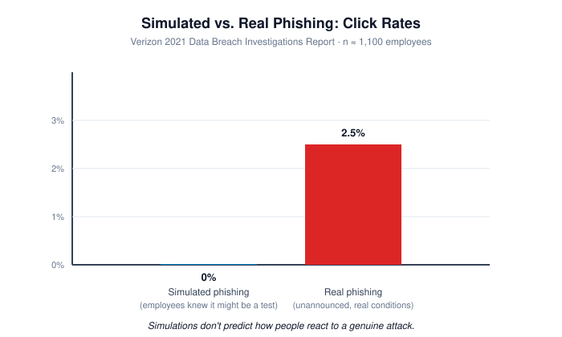
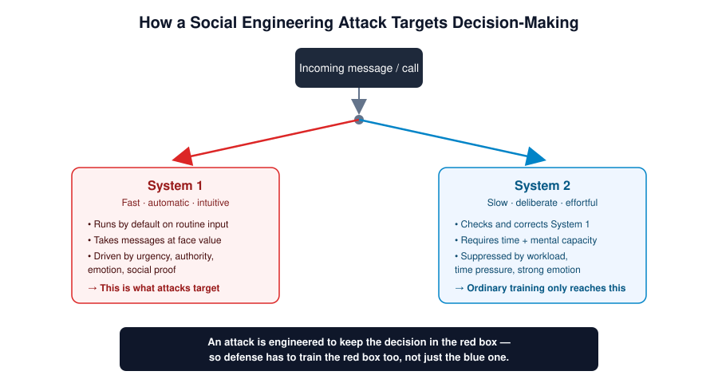

# Theoretical Foundations: Why Traditional Security Awareness Fails, and What the Science Says Instead

**A literature-grounded position paper underpinning my applied Cognitive Security practitioner framework**

*Status: living document — Part I of this repository. Part II (the practitioner framework architecture) is built from these foundations.*

---

## Abstract

I started out uneasy about two ideas that traditional cybersecurity awareness training is built on: that humans are the "weakest link" in the security chain, and that showing people facts and rules over and over again changes how they behave. In this paper I trace that unease back through the research to see whether it holds up — and it does. A growing body of evidence across information security, cognitive psychology, and behavioral science pushes back on both ideas. I review that evidence across seven areas — the "weakest link" idea and where it came from, controlled trials of awareness and phishing-simulation programs, the new field of Cognitive Security, dual-process theory, the persuasion science behind social engineering, the neuroscience of emotional memory, inoculation theory, and behavior change science — and I argue that all of this work points to one conclusion: to defend people against manipulation, you have to engage the same fast, gut-level (System 1) thinking that attackers exploit, not just the slow, deliberate (System 2) thinking that ordinary training targets. This is the foundation I build my practitioner framework on — a separate document in this repository — aimed at building "human firewalls": people equipped to recognize and stop manipulation on instinct, both at work and at home.

---

## 1. Introduction

I have watched organizations spend more and more on security awareness training for over two decades, driven by the well-documented fact that most breaches involve a human element somewhere along the way. The usual response to that fact, in my experience, has been to train harder: more frequent modules, more simulated phishing campaigns, more mandatory quizzes. But as I worked through the independent research, I found a large and growing body of work concluding that this approach doesn't reduce incidents — and in some cases makes the underlying problem worse.

I don't make that claim lightly, so in this paper I test it against the evidence. I organize the review around the two ideas I set out to challenge: the "weakest link" framing that blames end users, and the assumption that fact-based, repetitive training actually changes behavior when someone is under attack. I then look at the cognitive-science research that helped me understand *why* these ideas fail, and at related fields — persuasion science, memory neuroscience, inoculation theory, and behavior change science — that point toward what should replace them.

---

## 2. The "Weakest Link" Idea and Its Problems

The phrase "humans are the weakest link" entered information security mostly through Bruce Schneier's *Secrets and Lies* (2000) and Kevin Mitnick and William Simon's *The Art of Deception* (2002). Both books framed people as the point where otherwise strong technical defenses inevitably break down. I've watched this phrase spread through security-awareness blogs, industry publications, and even academic writing, to the point where some researchers now call it one of the field's unspoken core assumptions (Mc Mahon, 2020).

Mc Mahon's *In Defence of the Human Factor* (2020), published in *Frontiers in Psychology*, is the sharpest academic critique of this idea that I found. Mc Mahon argues that the "weakest link" framing survives not because it's accurate, but because it's convenient for organizations: blaming an individual's mistake is what Hollnagel and Amalberti (2001) call an "acceptable accident cause" in safety science — a simple, cheap explanation that avoids the harder, costlier work of fixing badly designed systems. I find this convincing. Mc Mahon also draws on Cross's (2015) research on how online fraud is discussed publicly, arguing that blaming end users is a form of victim-blaming — it isolates people who were deceived and makes them less likely to report incidents or warn co-workers, which is the opposite of what a security culture needs. He also cites Posey, Bennett, and Roberts (2011), whose study of insider behavior found that employees who feel their organization doesn't trust them respond to new security rules with *more* misuse of computer systems, not less. And he cites Bulgurcu, Cavusoglu, and Benbasat (2009), whose widely cited study found that a sense of fair treatment — not fear of blame — is what actually predicts whether people follow security policy.

This isn't just one academic's objection. Sasse, Brostoff, and Weirich (2001) made a similar argument nearly twenty years earlier, from a human-computer-interaction angle, calling for "transforming the weakest link" through better design rather than lectures. More recent research points the same way: work in safety science and organizational psychology increasingly treats most "human errors" in cybersecurity not as carelessness, but as the predictable result of mental limits, poor system design, unrealistic procedures, and unsupportive workplace culture all combining under pressure. Fear-based "blame-and-train" campaigns consistently end up suppressing incident reporting rather than encouraging it, and they produce what practitioners now call "security fatigue" and "compliance theatre" — people going through the motions with no real change in how vulnerable they are.

The lesson I take from this for training design is direct: a program built on top of a blame narrative is working against its own goal before I've even shown a single slide.

---

## 3. Evidence That Conventional Awareness Training Fails

Beyond the conceptual critique, I looked for controlled studies testing whether conventional awareness training and phishing simulations actually reduce real-world risk. What I found was strikingly consistent.

**Recent training makes no difference.** A large study by researchers at UC San Diego Health, presented at Black Hat USA, followed more than 19,500 employees over an eight-month randomized controlled trial. It found no meaningful link between how recently an employee had completed annual security-awareness training and whether they fell for a phishing simulation. The same study found that annual training combined with regular phishing simulations cut phishing susceptibility by only 1.7%, and that 56% of users failed at least one simulation by month eight regardless of how much training they'd had (Dameff & Mirian, presented 2025).

**Just-in-time training shows the same pattern.** Separate research from ETH Zurich looked at embedded phishing training — feedback given right when a user clicks a simulated phishing link. It found no meaningful difference in outcomes between trained and untrained groups, and specifically found that for the people most likely to fall for phishing, mandatory training gave no extra benefit at all (cited in Cybersecurity Dive, 2024 reporting on research from the University of Chicago, UC San Diego, and ETH Zurich).

**Employees themselves say the training is hollow.** Caputo, Pfleeger, Freeman, and Johnson (2014) found that employees widely saw annual company training as useless — they said it covered things they already knew and told them to do what they already believed they were doing. In other words, the training wasn't closing any real gap in knowledge or behavior; it was just going through the motions.

**Simulations don't predict how people react to real threats.** Verizon's 2021 Data Breach Investigations Report documented something I keep coming back to: among more than 1,100 employees who received both a real phishing email and a simulated one, not a single person clicked the simulated phish — but 2.5% clicked the real one. This suggests people behave differently when they suspect, even unconsciously, that they're being tested — which is exactly the opposite of what happens when a real attacker strikes.

**Fatigue and mistrust are measurable side effects.** Other research summarized in recent human-factors literature finds that badly run phishing simulations often annoy staff, add to organization-wide cybersecurity fatigue and mistrust, and can actually lower employees' confidence in their own ability to spot threats — the opposite of what the training is meant to do.

Taken together, this evidence — a randomized trial of nearly 20,000 people, several European university studies, industry breach-investigation data, and what employees themselves report — tells me more than just "awareness training is weak." It tells me that the standard way training is delivered (once a year, fact-heavy, out of context, graded with pass/fail simulations) is fundamentally mismatched to the mental processes it's trying to change. To understand why, I had to turn to cognitive science.

---

## 4. Cognitive Security as a New Field

The academic base I build my broader practitioner framework on is the emerging field of Cognitive Security (CogSec). Ask, Sütterlin, Müller, Lugo, Saari, Grahn, Canham, Hermansen, and Knox (2025), building on earlier work in the field, propose a single definition of cognitive security that applies across domains and even species: having trusted boundaries that protect cognitive assets from any kind of unauthorized influence or access. Their framework names four connected factors needed to maintain cognitive security: cognitive agility (the ability to adaptively manage biases, process information, and make decisions), machine psychology (protecting cognition-like functions in AI systems), neurosecurity (protecting the nervous system from biological or technological intrusion), and systems engineering (designing organizations and societies to be resilient). Related work building on this framework measures "human cognitive security" at the individual and team level through three things you can actually observe: how well people tell true from false, how well they act under uncertainty, and how they share information.

I find this research useful for two reasons. First, it treats human mental processes — attention, perception, memory, and the shortcuts and biases that shape judgment — as assets that need protecting, just like a network or a database. Second, it identifies information literacy, critical thinking, and the ability to reflect on one's own thinking as the factors that most directly strengthen a person's cognitive security. This gives my own goal — building critical thinking and self-awareness, not just rule-following — a real foundation in the academic CogSec literature, rather than leaving it as a personal add-on to standard awareness content.

Importantly, I read the CogSec literature as treating social engineering as one part — a highly visible and consequential one — of a much bigger category of cognitive threats that also includes disinformation, influence operations, and AI-enabled manipulation. This confirms how I see my own work: social engineering awareness is one application of a broader cognitive-defense framework I'm building, not the whole framework itself.

---

## 5. Dual-Process Theory and How Deception Works on the Mind

If Cognitive Security tells me *what* needs protecting, dual-process theory is what helped me understand *how* it gets attacked — and why I believe conventional training misses the target.

Dual-process theory says human judgment comes from two different systems, made famous by Kahneman (2011) in *Thinking, Fast and Slow*, building on decades of work by Kahneman, Tversky, Stanovich, Evans, and others. System 1 is fast, automatic, and intuitive — it runs on mental shortcuts that are efficient but prone to predictable mistakes. System 2 is slow, deliberate, effortful, and able to check and correct System 1's output — but only when it's actually switched on. Under time pressure, heavy mental workload, or strong emotion, System 2 often doesn't switch on at all, leaving System 1's snap judgments to run unchecked (Kahneman & Frederick, 2002; Evans, 2008).

This isn't just an abstract idea when it comes to social engineering. Phishing research has directly applied dual-process theory to explain why people fall for it: when reading an email, people generally take its content at face value and only start checking it carefully if something seems off — a pattern that fits with System 1 handling routine information by default (research cited in USEC 2024 studies on workload and phishing). Recent research on fraud decisions extends this into a three-stage model — a first gut (System 1) reaction, a stage where conflict gets noticed, and, only if conflict is noticed, a switch to System 2 thinking. This research finds that high mental workload — exactly the conditions of a busy inbox, an urgent phone call, or a rushed request — suppresses that checking stage and leads to more reliance on unchecked gut judgment (Pennycook et al.'s three-stage model, applied to fraud decisions in recent *Frontiers in Psychology* research, 2025).

The conclusion I draw from this is specific and testable: **a social engineering attack is, mechanically, an attempt to make sure System 2 never gets consulted.** Urgency, authority, and emotional pressure aren't just incidental parts of a convincing pretext — they're the actual mechanism the attack relies on, because they're specifically good at shutting down careful thinking. A training program that only ever speaks to System 2 — checklists, policy text, quiz questions answered calmly with no time pressure — is training a system that won't be the one making the decision when the attack actually happens.

---

## 6. Persuasion Science and How Social Engineering Works

I next wanted to understand exactly how social engineers shut down System 2 and get System 1 to comply, and found this well studied in persuasion science. Cialdini's six principles of influence — reciprocity, commitment/consistency, social proof, authority, liking, and scarcity — are the most widely used framework in this research, and several independent studies analyzing real phishing emails confirm that these principles aren't just theoretically relevant to social engineering — they actually show up in attack content at high rates (Bayl-Smith et al., 2021; Lawson et al., 2017; Akbar's analysis of 207 phishing emails).

Ferreira and Teles (2019) took this further in a way I find especially useful, by combining Cialdini's principles with Gragg's (2003) psychological triggers and Stajano and Wilson's (2011) principles of scams into one framework: the Principles of Persuasion in Social Engineering (PPSE). Their analysis of real phishing emails found that Authority, Strong Affect, Integrity, and Reciprocation were the most common principles used, with Strong Affect — content designed to trigger an emotional reaction strong enough to distract from careful thinking — most strongly linked to eye-catching visual design. Later studies extending this framework to phishing subject lines and full emails have consistently found Authority and Social Proof, often combined with Scarcity, to be the most common pairing of tactics across samples of attacks — and have found that people trained interactively, with the persuasion principles named and explained, do better at spotting these tactics than people given ordinary static training.

I take two things from this. First, it confirms what I suspected: attackers aren't improvising — they're using well-understood psychological levers with measurable, repeatable effects. It's a discipline, not a trick. Second, and more important for how I design training, it shows that these same principles can be taught defensively: training that makes the *persuasion mechanism itself* visible and nameable to the trainee — rather than just listing red flags — improves real-world detection. That's a very different goal than "spot the spelling error," and it's why I treat understanding persuasion, not just spotting warning signs, as core training content.

---

## 7. Emotion, Memory, and Why We Remember What Moves Us

My original hunch — that people remember what affects them emotionally — turns out to have solid backing in the neuroscience of memory, independent of any cybersecurity research at all.

A large and consistent body of work starting with Cahill and McGaugh (1995, 1996), and continued over the following decades, shows that emotionally arousing material sticks in long-term memory more reliably than neutral material with the same amount of information. Human brain-imaging studies (Cahill et al., 1996; Hamann et al., 1999; Dolcos et al., 2004) show that amygdala activity while encoding emotional information is strongly linked to how well people later recall it — in one well-known PET-imaging study, amygdala activation while watching emotionally arousing film footage strongly predicted how well people remembered it three weeks later. People with damage to both sides of the amygdala don't show this same memory boost for emotional material, which is what convinces me this is a cause-and-effect relationship, not just a coincidence (Cahill et al., 1995; Adolphs et al., 1997).

McGaugh's decades of work (summarized in McGaugh, 2004, 2018) explains the underlying mechanism, and it's the piece of this research I find most important for my own argument: emotional arousal triggers the release of stress hormones (adrenaline-type and cortisol-type), which activate signaling in the basolateral amygdala. That activity, in turn, strengthens the process by which memories being formed in the hippocampus and nearby brain regions get locked in. Crucially, this effect seems to depend on how *strong* the emotion is, not whether it's positive or negative — meaning the same mechanism works whether the emotional content is good or bad. That tells me this tool is available to defensive training built around genuine, positive emotional engagement, not just fear-based content.

This gives me solid neuroscience behind a claim I could previously only make informally: content delivered in a flat, low-energy, purely informational way is, by the brain's own memory-forming mechanics, less likely to stick than content that genuinely engages someone's emotions. When I say a training program built entirely around policy text and checklists is "boring," I now mean something more specific than a casual complaint — I mean it's working against the actual biological process by which lasting memory forms.

---

## 8. Inoculation Theory: Building Resistance Before the Attack

If the memory research told me *why* engaging training sticks, inoculation theory showed me *how* to structure that engagement so it builds resistance to manipulation, not just awareness of it.

Inoculation theory, developed by McGuire (1961) and McGuire and Papageorgis (1961) at Yale, is built on a medical comparison that I find genuinely clarifying: just as exposing the body to a weakened version of a germ triggers the immune system to build antibodies that protect against the full-strength version later, exposing a person to a weakened version of a persuasive or manipulative argument — paired with an explicit rebuttal of it — builds lasting psychological resistance to stronger versions of that same manipulation later on. The theory says two ingredients are needed: *threat* — a warning that your existing judgment is vulnerable to a specific kind of attack, which motivates you to resist it — and *refutational preemption* — actually practicing counterarguments before you meet the real thing. In the studies I reviewed, neither ingredient alone reliably built resistance; it's the combination that makes it last.

A meta-analysis by Banas and Rains (2010) confirmed strong inoculation effects across many different situations, and found evidence for what researchers call "umbrella protection" — resistance from inoculation carries over even to counterarguments and manipulation attempts that were never specifically covered in training, as long as the underlying *technique*, not just the specific claim, was addressed. I see this distinction — inoculating against a specific false claim versus inoculating against the underlying manipulative technique — as central to how I want to apply this research. Van der Linden and colleagues' work on "prebunking" showed that briefly exposing people to an explicit label for a manipulation technique — for example, pointing out manufactured urgency or false authority — meaningfully reduces how susceptible they are to that technique later, even in completely new situations.

This is the theoretical backbone I now have for treating social engineering defense as inoculation rather than instruction. It's also the clearest academic support I've found for a design instinct I already had before I went looking for the research: that showing people *how* a manipulation technique works — walking them through a weakened, safe version of it and then explicitly refuting it — builds more lasting resistance than just telling them the right answer and hoping they remember it under pressure.

---

## 9. Behavior Change Science: From Knowing to Doing

The last gap I think conventional awareness training fails to close is the one between knowing a fact and acting on it in real conditions — the gap between "the employee knew this was a scam" and "the employee reported it." Behavior change science, and specifically the COM-B model developed by Michie, van Stralen, and West (2011), gave me the clearest way I've found to understand why knowledge alone rarely closes this gap.

COM-B says any behavior comes from three things working together, each with its own sub-parts: Capability (physical and mental — does the person have the skill and knowledge to do the behavior?), Opportunity (physical and social — does their environment and culture actually allow and support the behavior?), and Motivation (reflective and automatic — do they consciously mean to do it, and does their gut-level disposition support that intention in the moment?). The key insight I take from this, and one I think often gets missed, is that traditional awareness training addresses almost exclusively mental Capability — the "knowing" part — while leaving Opportunity, and especially automatic Motivation, almost completely untouched. An employee can ace a phishing-awareness quiz (high mental Capability) and still click a well-crafted phishing email under time pressure in a workplace that doesn't support reporting (low social Opportunity, low automatic Motivation), because the training never touched the parts of the equation that actually control behavior in that moment.

I see this as directly matching the dual-process critique above: automatic Motivation in the COM-B model is, in practice, System 1. A training approach that boosts what people consciously know without touching their automatic, gut-level disposition is, as I see it, working on the one COM-B component that's least predictive of behavior under the exact conditions — urgency, distraction, social pressure — that social engineers deliberately create.

---

## 10. Putting It All Together: What the Research Points To

Read together, I don't think these seven bodies of research just criticize existing awareness training from seven different directions. I read them as pointing to one consistent diagnosis and one consistent design direction:

1. **The diagnosis:** Blame-based framing damages trust and suppresses the reporting behavior that security programs actually need (Section 2); controlled trials show that fact-based, out-of-context, low-emotion training doesn't produce measurable behavior change at scale (Section 3); dual-process theory explains why — this kind of training only speaks to System 2, while attacks are specifically engineered to bypass it (Sections 5, 6); and COM-B explains why knowledge gained from such training doesn't turn into behavior — it targets the wrong part of the equation (Section 9).

2. **The mechanism attackers already exploit:** documented, repeatable persuasion principles that manufacture urgency, authority, and emotion specifically to shut down careful thinking (Section 6).

3. **The mechanism available to defenders, sitting in the same part of the brain:** emotionally engaging content is more durably locked into memory through amygdala-driven processes, whether the emotion is positive or negative (Section 7); and pre-exposing people to a weakened, clearly-labeled version of a manipulation technique, paired with a rebuttal, builds resistance that carries over to new attacks — "umbrella protection" (Section 8).

4. **The bigger picture I place myself in:** Cognitive Security research already treats human mental processes as assets worth protecting in their own right, and already identifies critical thinking and self-reflection — not rule memorization — as the individual-level factors that most directly build resilience (Section 4).

What I take from all this, practically, is not that I should manipulate the people I train. It's that defenders — myself included, until I did this review — have spent two decades fighting an emotional, System-1-targeted threat with a purely rational, System-2-targeted defense, and the evidence for that mismatch is now well documented. An approach that instead uses inoculation-style, technique-revealing, emotionally engaging training — built with the same rigor social engineers apply to their attacks, but aimed at building lasting resistance instead of compliance — isn't, as far as I can tell, a departure from the science. It's the design the science already points toward.

I develop the specific architecture of that approach — its stages, its pillars, its practitioner methodology — in Part II of this repository, building it from this foundation rather than asserting it before doing the review laid out here.

---

## References

Adolphs, R., Cahill, L., Schul, R., & Babinsky, R. (1997). Impaired declarative memory for emotional material following bilateral amygdala damage in humans. *Learning & Memory*, 4(3), 291–300.

Ask, T. F., Sütterlin, S., Müller, L., Lugo, R. G., Saari, D., Grahn, H., Canham, M., Hermansen, D., & Knox, B. J. (2025). Cognitive Security: The study and practice of protecting the human mind and other cognitive assets from cognitive threats.

Banas, J. A., & Rains, S. A. (2010). A meta-analysis of research on inoculation theory. *Communication Monographs*, 77(3), 281–311.

Bulgurcu, B., Cavusoglu, H., & Benbasat, I. (2009). Roles of information security awareness and perceived fairness in information security policy compliance. *15th Americas Conference on Information Systems (AMCIS)*, 3269–3277.

Cahill, L., Haier, R. J., Fallon, J., Alkire, M., Tang, C., Keator, D., Wu, J., & McGaugh, J. L. (1996). Amygdala activity at encoding correlated with long-term, free recall of emotional information. *Proceedings of the National Academy of Sciences*, 93, 8016–8021.

Cahill, L., & McGaugh, J. L. (1995). A novel demonstration of enhanced memory associated with emotional arousal. *Consciousness and Cognition*, 4(4), 410–421.

Caputo, D. D., Pfleeger, S. L., Freeman, J. D., & Johnson, M. E. (2014). Going spear phishing: Exploring embedded training and awareness. *IEEE Security & Privacy*, 12(1), 28–38.

Cialdini, R. B. (2007). *Influence: The psychology of persuasion* (Rev. ed.). Harper Business.

Cross, C. (2015). No laughing matter: Blaming the victim of online fraud. *International Review of Victimology*, 21(2), 187–204.

Ferreira, A., & Teles, S. (2019). Persuasion: How phishing emails can influence users and bypass security measures. *International Journal of Human-Computer Studies*, 125, 19–31.

Gragg, D. (2003). *A multi-level defense against social engineering*. SANS Institute.

Hollnagel, E., & Amalberti, R. (2001). The emperor's new clothes: Or whatever happened to "human error"? *4th International Workshop on Human Error, Safety and Systems Development*.

Kahneman, D. (2011). *Thinking, fast and slow*. Farrar, Straus and Giroux.

Kahneman, D., & Frederick, S. (2002). Representativeness revisited: Attribute substitution in intuitive judgment. In T. Gilovich, D. Griffin, & D. Kahneman (Eds.), *Heuristics and biases: The psychology of intuitive judgment* (pp. 49–81). Cambridge University Press.

Mc Mahon, C. (2020). In defence of the human factor. *Frontiers in Psychology*, 11, 1390.

McGaugh, J. L. (2004). The amygdala modulates the consolidation of memories of emotionally arousing experiences. *Annual Review of Neuroscience*, 27, 1–28.

McGaugh, J. L. (2018). Emotional arousal regulation of memory consolidation. *Current Opinion in Behavioral Sciences*, 19, 55–60.

McGuire, W. J. (1961). The effectiveness of supportive and refutational defenses in immunizing and restoring beliefs against persuasion. *Sociometry*, 24(2), 184–197.

McGuire, W. J., & Papageorgis, D. (1961). The relative efficacy of various types of prior belief-defense in producing immunity against persuasion. *Journal of Abnormal and Social Psychology*, 62(2), 327–337.

Michie, S., van Stralen, M. M., & West, R. (2011). The behaviour change wheel: A new method for characterising and designing behaviour change interventions. *Implementation Science*, 6, 42.

Mitnick, K. D., & Simon, W. L. (2002). *The art of deception: Controlling the human element of security*. John Wiley & Sons.

Posey, C., Bennett, R. J., & Roberts, T. L. (2011). Understanding the mindset of the abusive insider: An examination of insiders' causal reasoning following internal security changes. *Computers & Security*, 30(6–7), 486–497.

Sasse, M. A., Brostoff, S., & Weirich, D. (2001). Transforming the weakest link: A human/computer interaction approach to usable and effective security. *BT Technology Journal*, 19, 122–131.

Schneier, B. (2000). *Secrets and lies: Digital security in a networked world*. John Wiley & Sons.

Stajano, F., & Wilson, P. (2011). Understanding scam victims: Seven principles for systems security. *Communications of the ACM*, 54(3), 70–75.

van der Linden, S., Leiserowitz, A., Rosenthal, S., & Maibach, E. (2017). Inoculating the public against misinformation about climate change. *Global Challenges*, 1(2), 1600008.

Verizon. (2021). *2021 Data breach investigations report*.

*(Additional 2025–2026 sources on phishing-training efficacy trials, Cialdini-principle content analyses, and the broader Cognitive Security field are drawn from ongoing research literature and will be fully incorporated with complete bibliographic details as the framework document in Part II is finalized.)*
